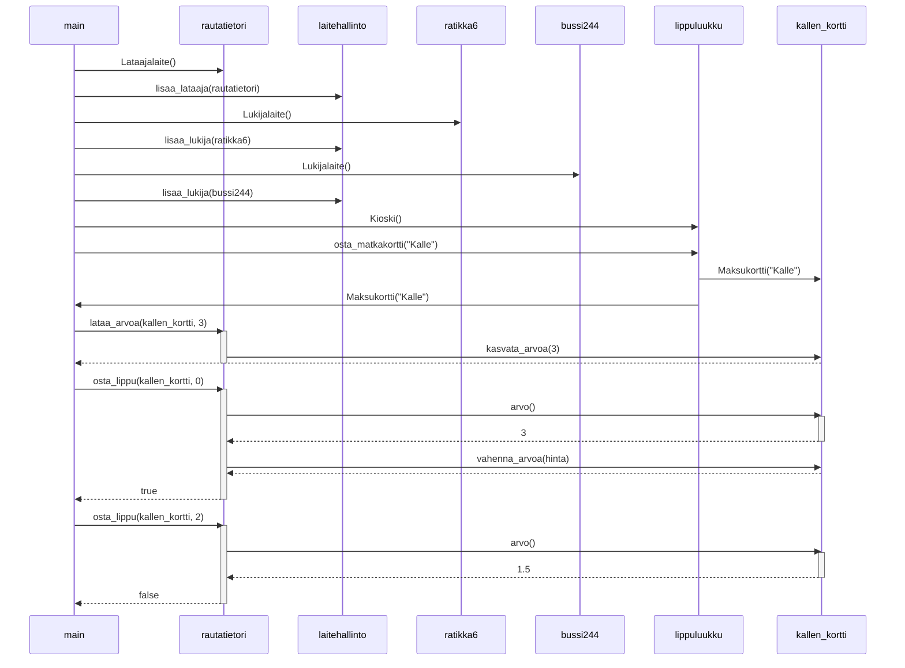

## HSL:n sekvenssikaavio, tehtävä 2

```mermaid
sequenceDiagram
    main->>rautatietori: Lataajalaite()
    main->>laitehallinto: lisaa_lataaja(rautatietori)
    main->>ratikka6: Lukijalaite()
    main->>laitehallinto: lisaa_lukija(ratikka6)
    main->>bussi244: Lukijalaite()
    main->>laitehallinto: lisaa_lukija(bussi244)
    main->>lippuluukku: Kioski()
    main->>lippuluukku: osta_matkakortti("Kalle")
    lippuluukku->>kallen_kortti: Maksukortti("Kalle")
    lippuluukku->>main: Maksukortti("Kalle")
    main->>rautatietori: lataa_arvoa(kallen_kortti, 3)
    activate rautatietori
    rautatietori->>kallen_kortti: kasvata_arvoa(3)
    kallen_kortti-->>main:
    deactivate rautatietori
    main->>rautatietori: osta_lippu(kallen_kortti, 0)
    activate rautatietori
    rautatietori->>kallen_kortti: arvo()
    activate kallen_kortti
    kallen_kortti-->>rautatietori: 3
    deactivate kallen_kortti
    rautatietori->>kallen_kortti:vahenna_arvoa(hinta)
    kallen_kortti-->>rautatietori:
    rautatietori-->>main: true
    deactivate rautatietori
    main->>rautatietori: osta_lippu(kallen_kortti, 2)
    activate rautatietori
    rautatietori->>kallen_kortti: arvo()
    activate kallen_kortti
    kallen_kortti-->>rautatietori: 1.5
    deactivate kallen_kortti
    rautatietori-->>main: false
    deactivate rautatietori
```