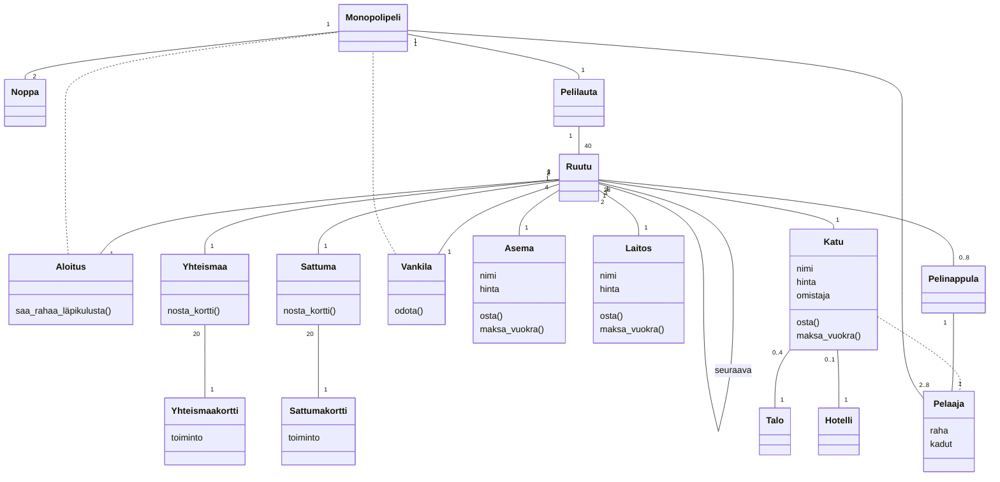

## Monopolin laajennettu luokkakaavio, tehtävä 1

```mermaid
 classDiagram
    Monopolipeli "1" -- "2" Noppa
    Monopolipeli "1" -- "1" Pelilauta
    Pelilauta "1" -- "40" Ruutu
    Ruutu "1" -- "1" Ruutu : seuraava
    Ruutu "1" -- "1" Aloitus
    Aloitus .. Monopolipeli
    Aloitus : saa_rahaa_läpikulusta()
    Ruutu "2" -- "1" Yhteismaa
    Yhteismaa "20" -- "1" Yhteismaakortti
    Yhteismaakortti : toiminto
    Yhteismaa : nosta_kortti()
    Ruutu "2" -- "1" Sattuma
    Sattumakortti : toiminto
    Sattuma : nosta_kortti()
    Sattuma "20" -- "1" Sattumakortti
    Ruutu "1" -- "1" Vankila
    Vankila .. Monopolipeli
    Vankila : odota()
    Ruutu "4" -- "1" Asema
    Asema : nimi
    Asema : hinta
    Asema : osta()
    Asema : maksa_vuokra()
    Ruutu "2" -- "1" Laitos
    Laitos : nimi
    Laitos : hinta
    Laitos : osta()
    Laitos : maksa_vuokra()
    Ruutu "28" -- "1" Katu
    Katu .. Pelaaja
    Katu : nimi
    Katu : hinta
    Katu : omistaja
    Katu : osta()
    Katu : maksa_vuokra()
    Katu "0..4" -- "1" Talo
    Katu "0..1" -- "1" Hotelli
    Ruutu "1" -- "0..8" Pelinappula
    Pelinappula "1" -- "1" Pelaaja
    Pelaaja "2..8" -- "1" Monopolipeli
    Pelaaja : raha
    Pelaaja : kadut
```